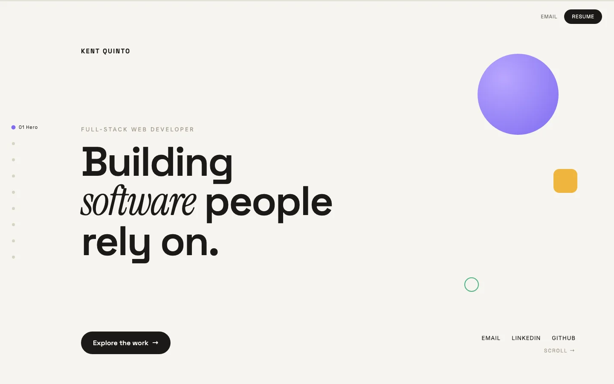

# Kent Quinto — Portfolio



**Live**: [kentquinto.es](https://kentquinto.es)

Personal portfolio site: a single-page, horizontally-scrolling story across nine sections
(Hero, About, Skills, Projects, Process, Experience, Languages, Playground, Contact).
Rather than a conventional vertical page, it plays out left to right like a story — one
beat per section — so visitors move through it deliberately instead of skimming and bouncing.

Design reference (tokens, copy, layout, motion for every section): [`docs/design-brief.md`](docs/design-brief.md).

## How this was built

Designed and directed by me. I structured the project for a clean, maintainable codebase and drove every design, content, and UX decision, testing the site end to end in a live browser myself. Built in close collaboration with Claude Code, which handled the TypeScript/React implementation as I continue building out that part of my stack.

## Features

- Horizontal, scroll-driven storytelling across 9 sections, with a full vertical fallback on mobile
- Scroll-tied reveal animations, cursor parallax, and magnetic buttons — all driven off shared Framer Motion values instead of per-frame React state
- A live theme switcher that recolors the whole site instantly, including a free-draw canvas that follows the active color
- Hover-to-front project cards and photo polaroids, so overlapping content never gets stuck unreadable behind another card
- Full keyboard navigation and `prefers-reduced-motion` support
- Genuinely responsive, not just resized: sections whose desktop layout is inherently horizontal (Process, Experience) get a real vertical redesign on mobile instead of a sideways-scrolling strip, and every touch-driven interaction (the draw canvas, the mouse-physics toys) uses Pointer Events so it works identically to the desktop mouse version

## Stack

- [Vite](https://vitejs.dev/) + React 19 + TypeScript
- CSS Modules over a shared design-tokens stylesheet (`src/styles/tokens.css`)
- [Framer Motion](https://www.framer.com/motion/) for scroll-tied reveals, parallax, and magnetic/tilt/hover interactions
- ESLint + Prettier + Husky (pre-commit `lint-staged`) + Vitest

## Project structure

```
src/
  components/
    layout/       Portfolio shell (scroll container, progress bar, nav rail, section wrapper)
    sections/      One folder per section, each with its own subcomponents co-located
  context/         Scroll/theme/pointer state — one file per concern, plus a matching hook
  hooks/           Scroll progress, reveal animations, magnetic/tilt/physics interactions
  data/            All section content and copy — nothing user-facing hardcoded in JSX
  styles/          Design tokens (CSS custom properties) + global resets/keyframes
  utils/           Pure, unit-tested logic, independent of React
  assets/          Optimized WebP photos and screenshots
```

## Development

```bash
npm install
npm run dev          # start the dev server
npm run build         # type-check + production build
npm run test           # run the Vitest suite
npm run lint            # eslint
npm run format          # prettier --write
```

## Deployment

Deploys to [Vercel](https://vercel.com) from `main` — a Vite static build (`npm run build`, output `dist/`), no server-side code or environment variables required. `develop` and feature branches get their own Vercel preview deployments automatically once the project is connected.

## Workflow

This repo follows git-flow:

- `main` — deployable, mirrors production (Vercel), and the GitHub default branch
- `develop` — integration branch
- `feature/*`, `fix/*`, `chore/*`, `content/*` — one branch per unit of work, PR'd into `develop` and squash-merged
  (`feat:`, `fix:`, `chore:`, `content:` commit prefixes respectively)

`develop` only merges into `main` once it's in a fully shippable state.
